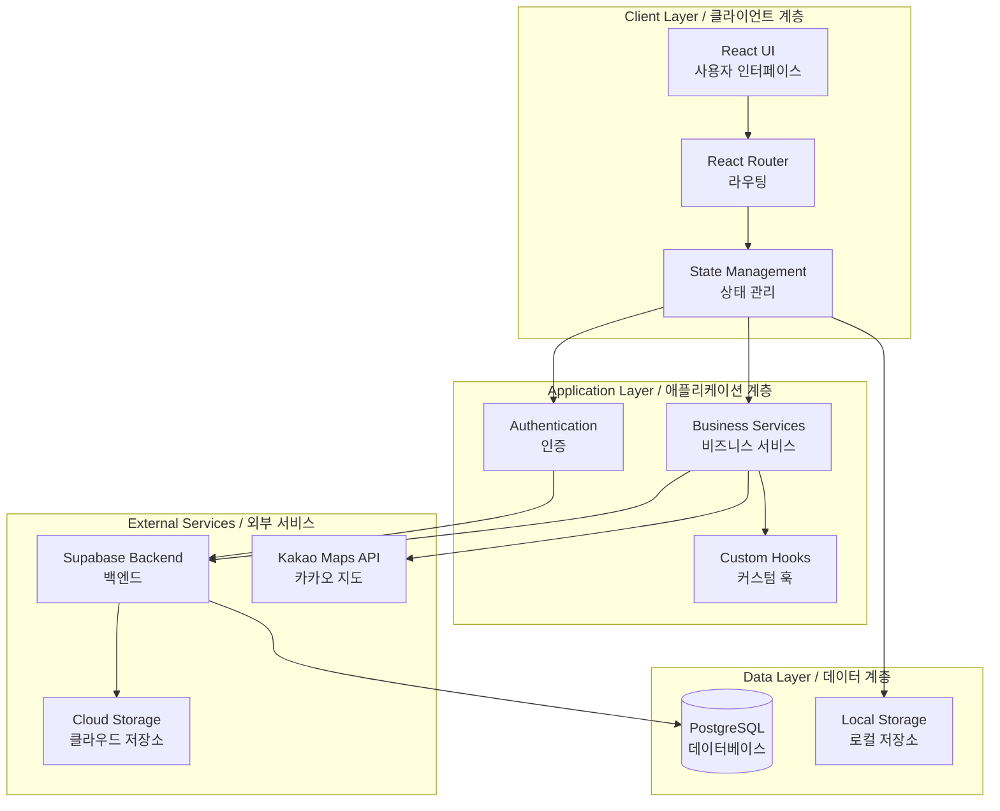
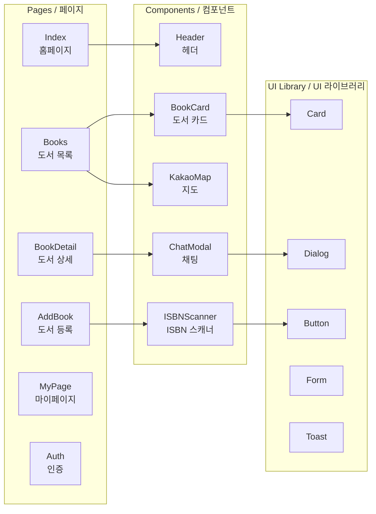
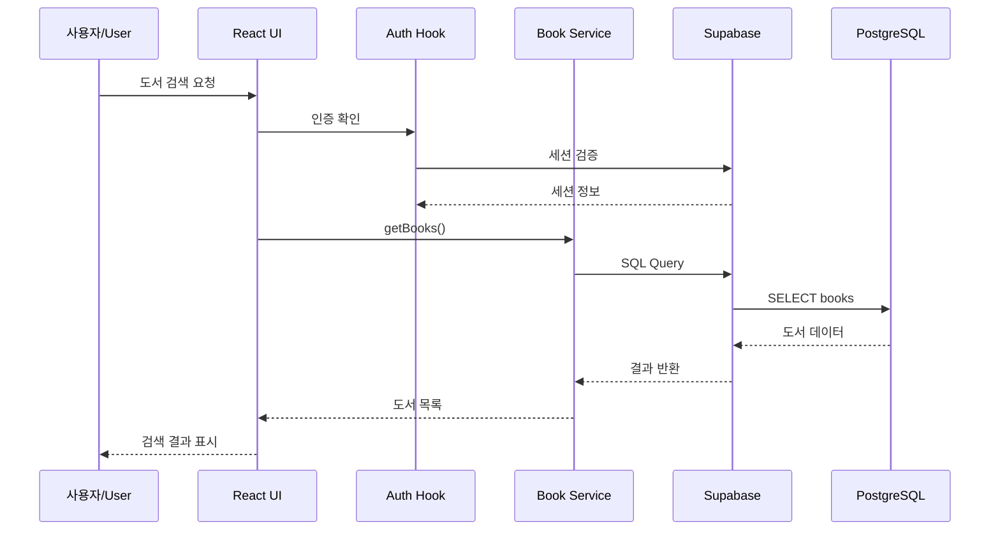
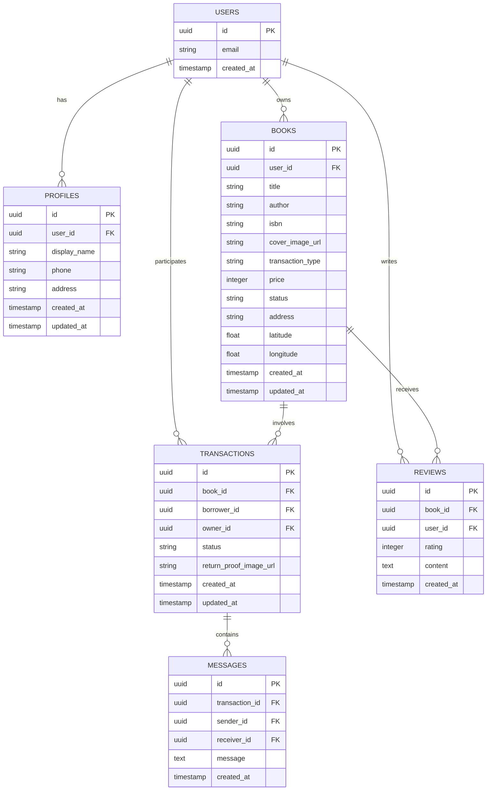
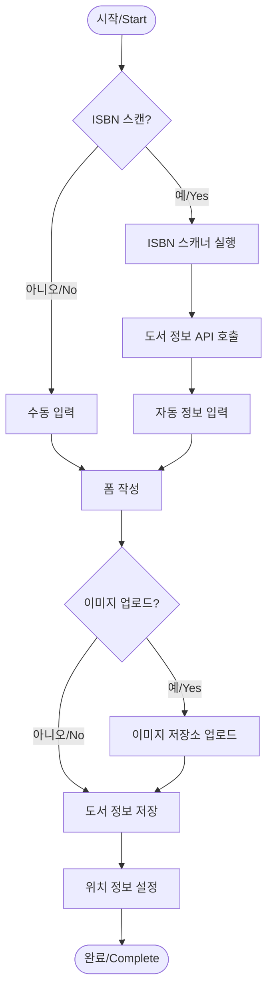
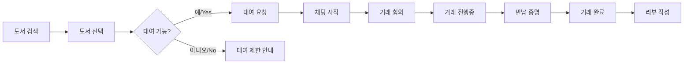
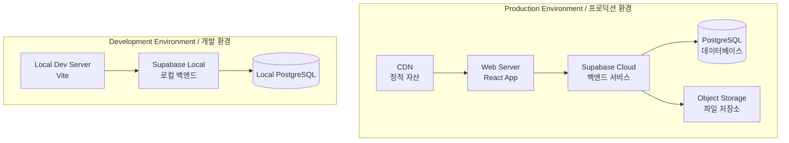

# 아키텍처 문서 / Architecture Documentation

## 개요 / Overview

### 한국어
이 문서는 BookSharing 애플리케이션의 시스템 아키텍처를 설명합니다. BookSharing은 사용자들이 책을 공유하고 대여할 수 있는 웹 기반 플랫폼입니다. 사용자는 자신의 책을 등록하여 판매하거나 대여할 수 있으며, 다른 사용자의 책을 검색하고 거래할 수 있습니다. 위치 기반 검색, ISBN 스캔, 실시간 채팅 등의 기능을 제공합니다.

### English
This document describes the system architecture of the BookSharing application. BookSharing is a web-based platform that allows users to share and rent books. Users can register their books for sale or rental, and search for and trade books from other users. It provides features such as location-based search, ISBN scanning, and real-time chat.

## 시스템 아키텍처 / System Architecture

### 전체 구조 / Overall Structure

### 한국어 설명
BookSharing 애플리케이션은 3계층 아키텍처로 구성되어 있습니다:
- **프레젠테이션 계층**: React 기반 UI와 라우팅 시스템
- **비즈니스 로직 계층**: 서비스와 커스텀 훅으로 구현된 애플리케이션 로직
- **데이터 계층**: Supabase를 통한 PostgreSQL 데이터베이스와 파일 저장소

### English Description
The BookSharing application is built with a 3-tier architecture:
- **Presentation Layer**: React-based UI and routing system
- **Business Logic Layer**: Application logic implemented with services and custom hooks
- **Data Layer**: PostgreSQL database and file storage through Supabase

## 컴포넌트 아키텍처 / Component Architecture

## 데이터 흐름 / Data Flow

## 데이터베이스 스키마 / Database Schema

## 주요 기능 흐름 / Key Feature Flows

### 도서 등록 프로세스 / Book Registration Process

### 도서 대여 프로세스 / Book Rental Process

## 기술 스택 / Technology Stack

### 프론트엔드 / Frontend
- **React 18.3**: UI 프레임워크
- **TypeScript**: 타입 안전성
- **Vite**: 빌드 도구
- **React Router**: 라우팅
- **TanStack Query**: 서버 상태 관리
- **Tailwind CSS**: 스타일링
- **shadcn/ui**: UI 컴포넌트 라이브러리

### 백엔드 / Backend
- **Supabase**: BaaS (Backend as a Service)
- **PostgreSQL**: 데이터베이스
- **Edge Functions**: 서버리스 함수
- **Row Level Security**: 데이터 보안

### 외부 서비스 / External Services
- **Kakao Maps API**: 위치 기반 서비스
- **ISBN API**: 도서 정보 검색
- **ZXing**: 바코드 스캔 라이브러리

## 보안 아키텍처 / Security Architecture

### 한국어
1. **인증 및 권한 부여**
   - Supabase Auth를 통한 사용자 인증
   - JWT 토큰 기반 세션 관리
   - Row Level Security (RLS)를 통한 데이터 접근 제어

2. **데이터 보호**
   - HTTPS를 통한 암호화된 통신
   - 민감한 정보의 서버 사이드 처리
   - XSS 방지를 위한 입력 값 검증 및 sanitization

3. **파일 보안**
   - 사용자별 격리된 저장소 경로
   - 공개/비공개 버킷 분리
   - 서명된 URL을 통한 임시 접근

### English
1. **Authentication & Authorization**
   - User authentication through Supabase Auth
   - JWT token-based session management
   - Data access control through Row Level Security (RLS)

2. **Data Protection**
   - Encrypted communication via HTTPS
   - Server-side processing of sensitive information
   - Input validation and sanitization for XSS prevention

3. **File Security**
   - Isolated storage paths per user
   - Separation of public/private buckets
   - Temporary access through signed URLs

## 배포 아키텍처 / Deployment Architecture

## 성능 최적화 / Performance Optimization

### 한국어
1. **프론트엔드 최적화**
   - 코드 분할 및 지연 로딩
   - 이미지 최적화 및 lazy loading
   - React Query를 통한 캐싱 전략

2. **데이터베이스 최적화**
   - 인덱스 최적화
   - 쿼리 최적화
   - 연결 풀링

3. **네트워크 최적화**
   - CDN 활용
   - 압축 (gzip/brotli)
   - HTTP/2 지원

### English
1. **Frontend Optimization**
   - Code splitting and lazy loading
   - Image optimization and lazy loading
   - Caching strategy through React Query

2. **Database Optimization**
   - Index optimization
   - Query optimization
   - Connection pooling

3. **Network Optimization**
   - CDN utilization
   - Compression (gzip/brotli)
   - HTTP/2 support

## 확장성 고려사항 / Scalability Considerations

### 한국어
1. **수평 확장**: Supabase의 자동 스케일링 기능 활용
2. **마이크로서비스 전환**: Edge Functions를 통한 기능 분리
3. **캐싱 전략**: Redis 도입 고려
4. **실시간 기능**: WebSocket을 통한 실시간 채팅 확장

### English
1. **Horizontal Scaling**: Utilizing Supabase's auto-scaling capabilities
2. **Microservices Migration**: Feature separation through Edge Functions
3. **Caching Strategy**: Considering Redis implementation
4. **Real-time Features**: Expanding real-time chat through WebSocket

## 모니터링 및 로깅 / Monitoring & Logging

### 한국어
- **로깅 시스템**: 커스텀 logger 유틸리티를 통한 중앙화된 로깅
- **에러 추적**: 프론트엔드 에러 바운더리 구현
- **성능 모니터링**: 주요 메트릭 추적
- **사용자 분석**: 사용자 행동 패턴 분석

### English
- **Logging System**: Centralized logging through custom logger utility
- **Error Tracking**: Frontend error boundary implementation
- **Performance Monitoring**: Key metrics tracking
- **User Analytics**: User behavior pattern analysis

## 향후 개선 계획 / Future Improvements

### 한국어
1. **기능 확장**
   - 추천 시스템 구현
   - 소셜 기능 강화
   - 다국어 지원

2. **기술적 개선**
   - PWA 전환
   - GraphQL 도입 검토
   - 테스트 커버리지 확대

3. **사용자 경험**
   - 모바일 앱 개발
   - AI 기반 도서 추천
   - 음성 검색 기능

### English
1. **Feature Expansion**
   - Recommendation system implementation
   - Enhanced social features
   - Multi-language support

2. **Technical Improvements**
   - PWA migration
   - GraphQL adoption consideration
   - Test coverage expansion

3. **User Experience**
   - Mobile app development
   - AI-based book recommendations
   - Voice search functionality

## 결론 / Conclusion

### 한국어
BookSharing 애플리케이션은 현대적인 웹 기술 스택을 활용하여 구축된 확장 가능한 도서 공유 플랫폼입니다. React와 Supabase를 기반으로 한 아키텍처는 빠른 개발과 안정적인 운영을 가능하게 하며, 향후 기능 확장과 성능 개선을 위한 견고한 기반을 제공합니다.

### English
The BookSharing application is a scalable book-sharing platform built with a modern web technology stack. The architecture based on React and Supabase enables rapid development and stable operation, providing a solid foundation for future feature expansion and performance improvements.